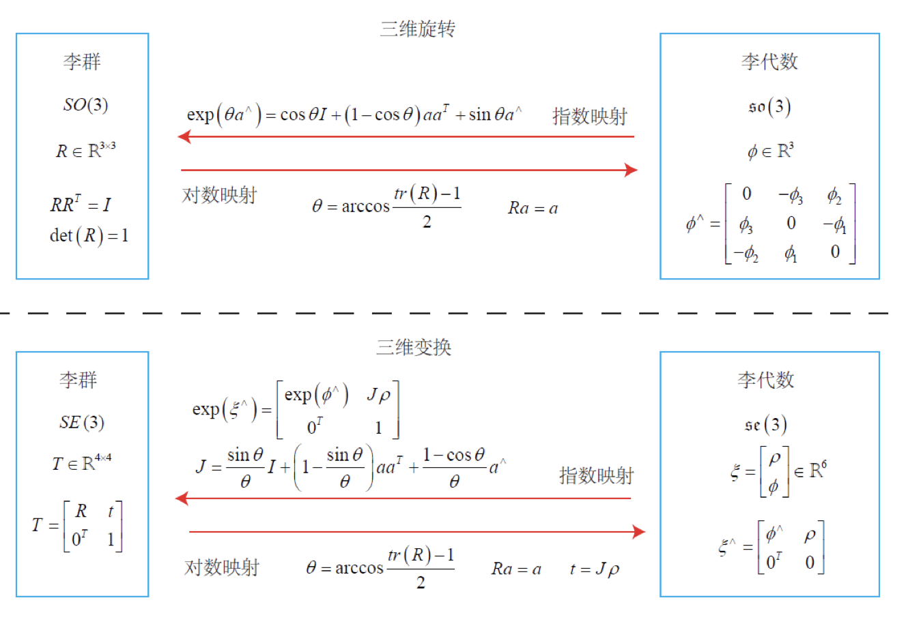

> 《SLAM視覺十四講》 ISBN：9789865501044 https://github.com/gaoxiang12/slambook2

SLAM
====
<a href="contents">

Contents
 * [3D空間方體運動](#contents)
 * [李群和李代數](#ch4)
 * [非線性最佳化](#ch6)
 * Vision Odometry
    - [Two-view Geometry](#ch7)
    - [Direct Method](#ch8)
 * [Back-end](#ch9)

 ### 3. 3D空間剛體運動
 3.3.1 旋轉向量
 從旋轉向量到旋轉矩陣的轉換過程由**Rodrigues's Formula**：
 

符號^是向量到screw-symmetric matrix的轉換符(外積cross操作變換)，對兩邊取trace可得：

關於轉軸，由旋轉軸上的向量在旋轉後不發生改變，說明：

因此轉軸是矩陣特徵值1的對應特徵向量。

3.3.2 尤拉角
它等於ZYX軸的旋轉，可以使用[r,p,y]T這樣一個向量描述任意旋轉，但尤拉角的缺點是會有Gimbal lock的問題；在對Y軸旋轉±90時，就會讓X軸變成-Z軸，因而在對X軸旋轉等於對Z方向軸轉，所以遺失了第三次旋轉。
1. yaw，繞物體Z軸旋轉
2. pitch，繞旋轉之後的Y軸旋轉
3. roll，繞旋轉之後的X軸旋轉

3.4 四元數(Quaterion)
可以用四元數描述3D空間中任意一個旋轉，且這表示式不具奇異性，四元數是複數的3D版：

其中i,j,k這三個虛數，滿足以下關係式：

在[p.3-24-3.25]有證明四元數到旋轉向量的轉換公式可得：

[Eigen對應MATLAB操作](https://igl.ethz.ch/projects/libigl/matlab-to-eigen.html)

###### 5.1.2 扭曲模型
1. 徑向扭曲 Radial Distortion: k1, k2, k3，主要有**桶形扭曲**和**枕形扭曲**。
2. [切向扭曲 Tangential distortion](https://de.mathworks.com/help/vision/ug/camera-calibration.html#bu0nj3f): p1, p2。

扭曲模型是在對歸一化平面上的點[x,y,1]計算：

---

---

然後將扭曲後的點透過內參投影到像素平面，獲得該點在影像上的像素位置：

### 4. 李群和李代數
群(Group)是一種集合加上一種運算的代數結構。我們以旋轉矩陣為例，旋轉對加法是不封閉的})，而乘法是封閉的})，因此對於這種只有一個良好的運算集合，我們稱之為群。

李代數就是用來解exponetial的矩陣運算，使得指數的矩陣具有對數相加的近似對映由[Baker-Campbell-Hausdorff](https://en.wikipedia.org/wiki/Baker%E2%80%93Campbell%E2%80%93Hausdorff_formula)公式近似出：

---

其中近似雅可比矩陣：

---

---

因為我們從微分方程解得旋轉矩陣有exponetial解[p.4-5-p.4.6]=\exp(\theta\mathbf{a}^\wedge)=\sum^\infty_{n=0}{\frac{1}{n!}(\theta\mathbf{a}^\wedge)^n})，該加總可推得**Rodrigues's Formula**；即我們將李代數so3中的任意元素，可知的大小就是旋轉角度，單位方向**a**是旋轉軸。Jl和Jr差在左乘還是右乘的指數矩陣相乘順序在對數相加上的對映。

由上圖可知，我們只要對se3中修改對應的元素，即se3=[平移,轉軸]，將新的se3取指數後相乘原來的Rt矩陣，就直接能獲得平移相加後的t'，旋轉是角度相加後的新的R'矩陣。但要注意作旋轉軸轉動會連帶改變平移，因為t與旋轉軸有關，即t=J*rho，改變的t'不會影響原始的R。

### 6. 非線性最佳化
目標函數的下降，實際步驟可寫成：[p.6-10]
1. 指定某個初值
2. 對於第k次反覆運算，尋找一個增量，使得}\parallel^2_2) 達到最小
3. 若 足夠小，則停止
4. 不然令，傳回第二步
5. 向量對向量的微分一定要是分母與分子是row/col或col/row的關係，才能微分出擴展開的矩陣Gradient或Jacobian。[look Matrix_claculus](https://en.wikipedia.org/wiki/Matrix_calculus)
6. 在SLAM領域中，偏好的是：如果為vector-by-vector就以Jacobian形式微分；如果是scalar-by-vector就以gradient形式微分；若為scalar-by-matrix也是以Jacobian形式微分。

在附近對目標函數進行泰勒展開：

1. 如果保留一階梯度，取變化量為反向梯度，即可保證函數下降：

這種方法被稱**最速下降法**或梯度下降法。

2. 保留二階梯度資訊；求右側等式關於的導數並令它為零：

求解這個線性方程式，就獲得了變化量(增量)。該方法又稱作**牛頓法**，但其中的Hessian矩陣(二階導數)難以計算又複雜。

##### 6.2.2 高斯牛頓法
它的思想是將函數只進行一階的泰勒展開，並在這一階展開作最小平方近似：

求上式關聯導數，並令其為零得：

等式左邊的 **JJ^T**被作為Hessian矩陣(二階梯度)的近似，進一步省略了計算**H**的過程。但在實際資料中， **JJ^T**卻只有半正定，這表示會出現無限多組解(homogenious solution with partical solution)，使得求出來的步進值太大，造成發散。因此LM在某個程度上修正了這些問題，一般認為它比高斯牛頓法更穩固，但它的收斂速度可能更慢。

##### 6.2.3 Levenburg-Marquadt's method (LM)
LM就是在高斯牛頓的目標近似函數加上約束，在Machine leraning稱作Regularization正則化，使得，將變化量約束在一個橢球中：

---

我們看到，當lambda比較小時，**JJ^T**佔主要地位，這說明二次近似模型在該範圍內是比較好的，LM方法更接近高斯牛頓法。當lambda比較大時，佔主導地位，LM方法更接近一階梯度下降法(即最速下降)，這說明附近的二次近似不夠好。

這個初值是不可隨意設定的，在視覺SLAM中，我們會用ICP或PnP之類的演算法來提供合理的最佳化初值。[p.6-16, 6-17]

----

### 7. Two-view Geometry
對影像提取特徵點的方法有許多種諸如：SIFT、SURF、ORB。這些人工設計的特徵點不外忽擁有以下性質：
1. Repeatability：相同的特徵點可以在不同影像上找到
2. Distinctiveness：不同特徵有不同表達
3. Efficiency：特徵點數量應遠小於像素的數量
4. Locality：特徵僅與一小片影像區域相關

特徵點由**關鍵點(Key-Point)** 和 **描述子(Descriptor)** 組成。關鍵點是指該特徵點在影像裡的位置；描述子通常是一個向量，按照人為設計的方式，描述了該關鍵點周圍像素的資訊。描述子是按照「外觀相似的特徵應該有相似的描述子」的原則設計的。因此，只要兩個特徵點在描述子的向量空間上的距離相近，就可以認為它們是同樣的特徵點。[p.7-5, 7.1]

>[7.1] Nixon, Mark, and Alberto Aguado. Feature extraction and image processing for computer vision. Academic press, 2019.

##### 7.2.3 計算相機運動

###### 7.3.1 2D-2D epipolar geometry
[直接參考CSDN：视觉SLAM——两视图对极几何 本质矩阵 基础矩阵 单应矩阵 三角测量](https://blog.csdn.net/qq_41839222/article/details/88104027)

###### 7.7 3D-2D PnP
Perspective-n-Point是求解3D到2D點對的運動方法。它描述了當知道n個3D空間點及其投影位置時，如何估計相機的位姿。PnP問題有很多種求解方法：P3P[7.2]、DLT、EPnP[7.3]、UPnP[7.4]。其中求解Homography轉換就是DLT。

■ 直接線性轉換 DLT:
考慮某空間點P1，投影到相機座標點x1(以歸一化平面表示)得：

---

從上式可以發現，每一點 xi 就提供了兩組方程式，求解 t 有12個自由度，但只需要6個點對就有12組方程式，滿足線代的滿秩。注意這裡的相機座標點並非圖像的座標點，這裡的 xi 是還沒乘上相機內參的位置點。因此在程式中對圖像找到的2D-3D匹配點後，還要將 xi 乘上相機內參求解：

我們在李代數裡知道對「指數矩陣」的微分使用擾動模型近似為[p.4-18]：

**Let P' = TP and u' = KP'**

---

也有對3D點P作最佳化：

**∵ P' = RP+t**

>[7.2] Gao, Xiao-Shan, et al. "Complete solution classification for the perspective-three-point problem." IEEE transactions on pattern analysis and machine intelligence 25.8 (2003): 930-943.
[7.3] Lepetit, Vincent, Francesc Moreno-Noguer, and Pascal Fua. "Epnp: An accurate o (n) solution to the pnp problem." International journal of computer vision 81.2 (2009): 155.
[7.4] Penate-Sanchez, Adrian, Juan Andrade-Cetto, and Francesc Moreno-Noguer. "Exhaustive linearization for robust camera pose and focal length estimation." IEEE transactions on pattern analysis and machine intelligence 35.10 (2013): 2387-2400.

##### 7.9 3D-3D ICP
Iterative Closet Point 並沒有出現相機內參，也就是說我們不作投影，在兩個點雲集中，只能認為距離最近的兩個點為同一個，所以這個方法稱為反覆運算最近點。[p.7-54]

■ SVD方法
目標求解相機的相對Rt，在已知配對n個點雲P與P'的情況：

---

由上式可知一旦用左邊求得R馬上就能用這個R代入右邊加法為零找t，R的求解[p.7-56, 7.5]：

對W作SVD分解，當W滿秩時，R為：

---

如果此時R的行列式為負，則取-R作為最佳值。

>[7.5]Pomerleau, François, Francis Colas, and Roland Siegwart. "A review of point cloud registration algorithms for mobile robotics." (2015).

### 8. Direct Method
由於在關鍵點與描述子的計算上非常耗時，還有特徵點捨棄了大部分可能有用的像素點，再來影像可能會遇上沒有明顯紋理資訊的畫面，使得特徵點不足比對點來計算匹配。為了克服上述問題，有以下解法：
1. 保留關鍵點，不計算描述子；使用光流法追蹤關鍵點的運動
2. 提供想要追蹤的點，直接對這些點進行追蹤，最佳化找出相機運動

###### 8.2 光流
光流的基本假設：
● 灰階不變假設
● 某一視窗內的像素具有相同的運動
可得：

考慮一個大小為w×w的窗口，該窗口內的像素具有相同的運動，因此我們有w^2個方程式：

在實際函數實現中，我們求解這樣一個問題：

因此對應的影像梯度為第二個影像在x+Δx, y+Δy處的梯度，但根據Lucas-Kanade光流論文，這裡的梯度也可以用第一張影像的梯度I1(x,y)來代替。這種代替的方法稱為反向光流法；在反向光流中，I1(x,y)的梯度是保持不變的，所以我們在反覆運算時保留影像梯度，即H矩陣不變，每次計算只須計算影像相減的部份，可以節省一部分計算。

在計算光流時，用影像金字塔從頂層影像開始計算，然後把上一層的追蹤結果，作為下一層的初值，這樣的好處是，當原始影像的像素運動較大時，在金字塔頂層的影像看來，運動仍然在一個很小的範圍，這時就明顯好於直接在原始影像上作最佳化。

###### 8.4 直接法
直接法的想法是由參考p1像素位置，根據目前相機的位姿估計值尋找在目前禎上p1的像素位置，但此時最小化的不是重投影誤差，而是光度誤差，也就是P點在兩個影像上像素的亮度差異：

注意因為T會影響到Z的大小，故這裡的Z1與Z2是不同相機位姿的成像平面距離，在這裡的代碼是I1固定與p1固定，更動T來產生不同的p2在I2的位置u去比較p1在I1上的亮度值

這裡的Jacobian為：

其中dI2/du為I2在位置u上的梯度，而du/ddxi已經在第七講中DLT裡描述過。

在本章中，我們只計算了單一像素的差異，並且這些差異是由灰階直接相減獲得的。然而單一像素沒有什麼區分性，所以有時我們會使用Normalized Cross Correlation作為度量方式。[p.8-30]

----

### Back-End
在沒有運動方程式的情況下，整個最佳化問題就只由許多個觀測方程式組成。這就非常類似SfM問題，相當於我們透過一組影像來恢復運動和結構。不同的是，SLAM中的影像有時間上的順序，而SfM中允許使用完全無關的影像。[p.9-3]

###### 9.2 Bundle Adjustment
所謂BA，是指從視覺影像中提煉出最佳的3D模型和相機參數。考慮從任意特徵點發射出來的幾束光線(bundles of light rays)，它們會在幾個相機的成像平面上變成像素。如果我們調整各相機姿態和各特徵點的空間位置，使得這些光線最後收束到相機的光心，就稱為BA。[p.9-13]原理就像第7講的PnP。

在求解BA時，我們會對各相機位姿和特徵點建構出一個很大的稀疏矩陣H，H矩陣被分成四塊(2×2)，左上對角塊(H11 or B)只和相機位姿有關，右下對角塊(H22 or C)只和路標點有關；非對角區塊(H12,H21 or E, E^T)是看作是相機位姿與觀測點的偏導對應索引的乘積。

在SLAM裡最常用的求解方法為Schur消去，也稱作邊緣化(Marginalization)

---

由上式可以觀察到，方程式第一行與Δxp無關了，可以單獨先求得Δxc再利用該解去求Δxp；從機率的角度來看，我們稱這一步為邊緣化，是因為我們實際上把求(Δxc, Δxp)的問題，轉化成了先固定Δxp，求出Δxc，在求Δxp的過程。這一步相當於做了條件機率展開[p.9-23]：

這結果是求出了關於xp的邊緣分佈，故稱邊緣化。

在SLAM最優化時的核心函數Huber就是深度學習的L1-smooth。[p.9-24]

----
為了SLAM系統的實時性，我們通常要控制BA的規模，常見的方式有：

###### 10.1.2 滑動視窗法(關鍵頁框)
保持被邊緣化的關鍵頁框的估計值，求其他狀態變數以這個關鍵頁框為條件的機率[p.10-3~p.10-6]
###### 10.2 位姿圖
即只最佳化相機位姿，不作路標點的最佳化[p.10-7]

位姿圖的節點可以用相機位姿T1, T2, ...Tn來表達。而邊是以兩位姿節點之間的相對運動估計：

建置誤差為：[p.10-8]

誤差關於兩個位姿的Jacobian矩陣：

---

---

如何實作，可參考代碼[slambook2/ch10/pose_graph_g2o_lie_algebra.cpp](https://github.com/gaoxiang12/slambook2/blob/master/ch10/pose_graph_g2o_lie_algebra.cpp)